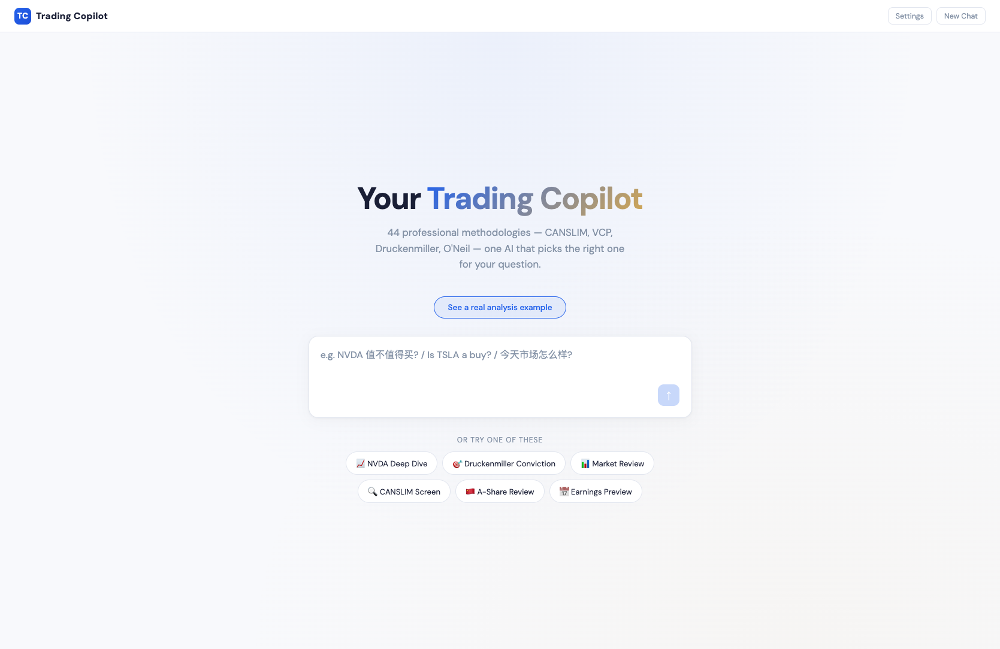
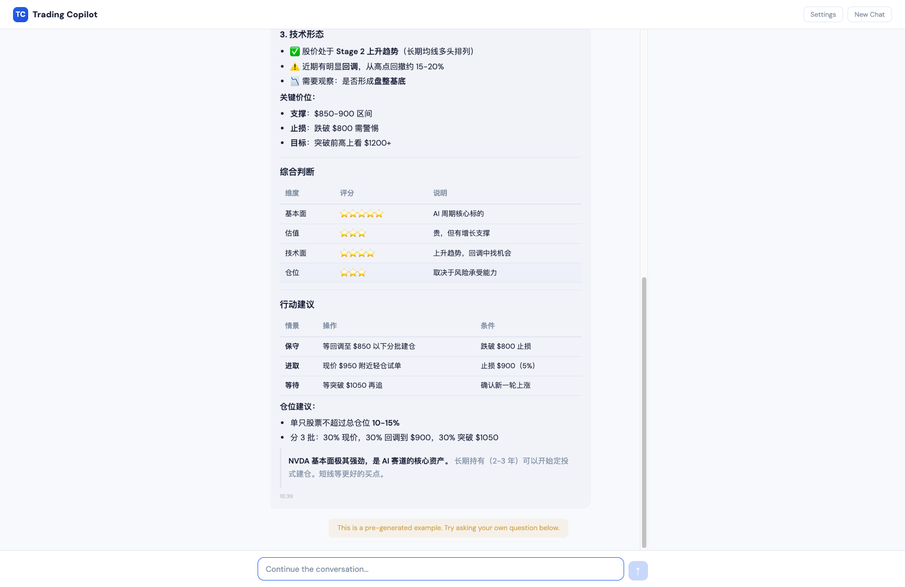

<div align="center">

# Trading Copilot

**43 professional trading methodologies. One AI that picks the right one for your question.**

[](LICENSE)
[](https://trading-skills-catalog-xbb3.vercel.app/catalog)
[](https://trading-skills-catalog-xbb3.vercel.app/)

[**Try It Now**](https://trading-skills-catalog-xbb3.vercel.app/) · [Skill Catalog](https://trading-skills-catalog-xbb3.vercel.app/catalog)

</div>

<p align="center">
  
</p>

<p align="center">
  
</p>

---

## What is this?

Traders need many different analysis methods — CANSLIM for growth screening, VCP for breakout patterns, Druckenmiller for strategy synthesis, O'Neil for market timing. But remembering 43 methodologies and knowing which one to use when is hard.

**Trading Copilot solves this.** Describe your trading idea in plain language (English or Chinese). The AI automatically picks the right methodology and gives you structured, actionable analysis — with entry prices, stop losses, and position sizing.

- No setup required — [open the web app](https://trading-skills-catalog-xbb3.vercel.app/) and start asking
- Free AI (MiniMax M1) — no API key needed to try
- Live market data (Yahoo Finance) — real prices, not hallucinated numbers
- Works in English and Chinese
- All 43 skills included in this repo — fully self-contained

## 架构

```
┌──────────────────────────────────────────────────┐
│              Trading Copilot (Web)                │
│         用户输入交易想法 → AI 自动分析             │
├─────────────────────┬────────────────────────────┤
│  Landing Page       │  Chat Mode                 │
│  居中输入框          │  流式 Markdown 渲染         │
│  6 个快捷按钮        │  对话历史持久化             │
│  用户 Profile        │  Copy / 时间戳              │
└─────────────────────┴────────────────────────────┘
          │                        │
          ▼                        ▼
┌──────────────────┐    ┌──────────────────────────┐
│  Vercel Serverless│    │  System Prompt (SKILL.md) │
│  /api/chat.js    │    │  43 trading methodologies           │
│  /api/config.js  │    │  Intent Routing 表        │
└────────┬─────────┘    │  输出格式规范              │
         │              └──────────────────────────┘
         ▼
┌──────────────────┐
│  MiniMax M1 (免费) │
│  或 Anthropic BYOK │
└──────────────────┘
```

## 快速开始

### 在线使用（零安装）

打开 [Trading Copilot](https://trading-skills-catalog-xbb3.vercel.app/) → 输入你的交易想法 → 得到分析。

### 本地运行

```bash
# 1. 克隆仓库
git clone https://github.com/zinan92/trading-copilot.git
cd trading-copilot

# 2. 安装依赖
pip install fastapi uvicorn httpx

# 3. 启动（MiniMax 免费 AI）
MINIMAX_API_KEY=your_key python3 app/server.py

# 4. 打开 http://localhost:3000
```

### Claude Code 用户

```bash
# All 43 skills are included — no external repo needed
git clone https://github.com/zinan92/trading-copilot.git
cd trading-copilot && ./install.sh

# Use in Claude Code
/trading-hub
```

## 功能一览

| 功能 | 说明 | 状态 |
|------|------|------|
| Trading Copilot Chat | Web AI trading assistant with auto methodology routing | ✅ |
| 43 Trading Methodologies | CANSLIM, VCP, Druckenmiller, Buffett, O'Neil + more | ✅ |
| Live Market Data | Real-time prices via Yahoo Finance (indexes + stocks) | ✅ |
| Streaming Markdown | Tables, headers, bold rendered in real-time | ✅ |
| Thinking UI | Cursor-style progress (Fetching → Analyzing → Generating) | ✅ |
| User Profile | Trading style/market/risk preferences for personalized analysis | ✅ |
| Dual AI Provider | MiniMax (free) + Anthropic Claude (BYOK) | ✅ |
| Chat Persistence | History saved in localStorage, survives refresh | ✅ |
| Demo Showcase | Pre-generated NVDA analysis, zero API key needed | ✅ |
| 43 Skills in Repo | Fully self-contained, no external dependencies | ✅ |
| Vercel Deployment | Free cloud hosting, accessible from any device | ✅ |

## 内置方法论

| 分类 | 数量 | 核心方法 |
|------|------|---------|
| Macro & Regime | 5 | macro-regime-detector, macro-liquidity, us-market-sentiment, us-market-bubble-detector, market-environment-analysis |
| Market Timing | 6 | market-breadth-analyzer, breadth-chart-analyst, market-top-detector, ftd-detector, uptrend-analyzer, market-news-analyst |
| Stock Screening | 8 | canslim-screener, vcp-screener, pead-screener, dividend-growth-pullback-screener, value-dividend-screener, finviz-screener, theme-detector, institutional-flow-tracker |
| Stock Analysis | 5 | us-stock-analysis, us-value-investing, tech-earnings-deepdive, technical-analyst, btc-bottom-model |
| Strategy & Execution | 8 | stanley-druckenmiller-investment, position-sizer, options-strategy-advisor, backtest-expert, risk-management, pair-trade-screener, scenario-analyzer, trade-hypothesis-ideator |
| Earnings | 3 | earnings-calendar, earnings-trade-analyzer, economic-calendar-fetcher |
| Portfolio | 2 | portfolio-manager, sector-analyst |
| A-Share | 6 | ashare-daily-review, ashare-concept-tracker, ashare-signal-scanner, ashare-stock-screener, ashare-watchlist-briefing, trading-hub |

## 预设工作流

| 工作流 | 步骤 |
|--------|------|
| 晨间复盘 | economic-calendar → market-news → breadth → sector → bubble-detector |
| 选股流程 | screener (CANSLIM/VCP/Theme) → stock-analysis → position-sizer |
| 财报季 | earnings-calendar → tech-earnings-deepdive → earnings-trade-analyzer |
| 策略合成 | 8 upstream skills → druckenmiller synthesizer → 0-100 conviction score |
| A 股复盘 | daily-review → concept-tracker → signal-scanner → watchlist-briefing |

## 技术栈

| 层级 | 技术 | 用途 |
|------|------|------|
| 前端 | HTML + CSS + JS (单文件) | Chat 终端 UI |
| 渲染 | marked.js + DOMPurify | Markdown 安全渲染 |
| 字体 | DM Sans + DM Mono | 金融科技风格 |
| 后端(本地) | FastAPI + httpx | API 代理 + 流式转发 |
| 后端(云端) | Vercel Serverless (Node.js) | 零运维部署 |
| AI | MiniMax M1 (免费) / Anthropic Claude | 对话生成 |
| 持久化 | localStorage | 用户 Profile + 聊天记录 |

## 项目结构

```
trading-copilot/
├── app/                          # Trading Copilot (web app)
│   ├── index.html                # Chat terminal UI
│   ├── server.py                 # FastAPI local server (with data prefetch)
│   └── prompts/SKILL.md          # System prompt with all methodologies
├── api/                          # Vercel Serverless Functions
│   ├── chat.js                   # AI proxy (MiniMax/Anthropic) + Yahoo Finance data
│   └── config.js                 # Config endpoint
├── skills/                       # All 43 trading methodology skills
│   ├── canslim-screener/         # O'Neil CANSLIM growth screening
│   ├── vcp-screener/             # Minervini VCP breakout patterns
│   ├── stanley-druckenmiller-investment/  # Strategy synthesis (0-100 conviction)
│   ├── tech-earnings-deepdive/   # 16-module earnings analysis
│   ├── market-top-detector/      # O'Neil distribution day detection
│   ├── ftd-detector/             # Follow-through day confirmation
│   ├── ... (43 skills total)     # See full list in "Built-in Methodologies"
│   └── trading-hub/              # Unified entry point for Claude Code
├── docs/screenshots/             # Product screenshots
├── catalog.html                  # Skill catalog display page
├── vercel.json                   # Vercel deployment config
├── install.sh                    # Claude Code skill installer
└── LICENSE                       # MIT
```

## 配置

| 变量 | 说明 | 必填 | 默认值 |
|------|------|------|--------|
| `MINIMAX_API_KEY` | MiniMax API Key (免费 AI) | 是(二选一) | 无 |
| `ANTHROPIC_API_KEY` | Anthropic API Key (BYOK) | 是(二选一) | 无 |
| `FMP_API_KEY` | Financial Modeling Prep (Claude Code skills 用) | 否 | 无 |

不设 API key 时，用户可在网页 Settings 中手动输入自己的 key。

## For AI Agents

本节面向需要将此项目作为工具或依赖集成的 AI Agent。

### 结构化元数据

```yaml
name: trading-copilot
description: AI trading analysis terminal with 43 professional methodologies and auto-routing
version: 1.0.0
type: web-app + claude-code-skill-collection

web_app:
  url: https://trading-skills-catalog-xbb3.vercel.app/
  api_base: https://trading-skills-catalog-xbb3.vercel.app/api
  endpoints:
    - path: /api/chat
      method: POST
      description: Send trading question, get streaming AI analysis
      body:
        message: string (user's trading question)
        history: array (conversation history)
        provider: string (minimax | anthropic)
        api_key: string (optional, for BYOK)
        user_profile: string (optional, trading preferences)
      response: text/event-stream
    - path: /api/config
      method: GET
      description: Check available AI providers

skill_entry_point:
  name: trading-hub
  trigger: /trading-hub
  description: Menu-driven entry point with 5 workflows and 6 category browsers

install_command: ./install.sh
health_check: curl https://trading-skills-catalog-xbb3.vercel.app/api/config

capabilities:
  - auto-route user trading intent to best analysis methodology
  - analyze stocks using CANSLIM, VCP, Buffett, Druckenmiller frameworks
  - synthesize market breadth, regime, and timing into conviction score (0-100)
  - calculate position sizes using Kelly criterion and ATR
  - screen stocks by natural language conditions
  - analyze tech earnings with 16-module institutional framework

categories:
  macro_regime: 5 methods
  market_breadth_timing: 5 methods
  stock_screening: 10 methods
  stock_analysis_reports: 9 methods
  strategy_execution: 10 methods
  ashare: 5 methods
```

### Agent 调用示例

```python
import httpx

async def ask_trading_copilot(question: str):
    """Ask Trading Copilot a trading question and get streaming analysis."""
    async with httpx.AsyncClient() as client:
        async with client.stream(
            "POST",
            "https://trading-skills-catalog-xbb3.vercel.app/api/chat",
            json={"message": question, "provider": "minimax"},
            timeout=60
        ) as resp:
            async for line in resp.aiter_lines():
                if line.startswith("data: "):
                    data = json.loads(line[6:])
                    if data["type"] == "text":
                        print(data["text"], end="", flush=True)
                    elif data["type"] == "done":
                        break

# Example
await ask_trading_copilot("帮我分析一下 NVDA 值不值得买入")
```

## 相关项目

| 项目 | 说明 | 链接 |
|------|------|------|
| tradermonty/claude-trading-skills | 30+ 交易分析 Skills 源头 | [GitHub](https://github.com/tradermonty/claude-trading-skills) |
| Day1Global-Skills | 机构级财报分析 Skill | [GitHub](https://github.com/star23/Day1Global-Skills) |
| AI-Trader | 多 AI 模型实盘竞技 | [GitHub](https://github.com/HKUDS/AI-Trader) |
| TradingAgents | 多 Agent 交易框架 | [GitHub](https://github.com/TauricResearch/TradingAgents) |
| daily-stock-analysis | A/H/US 自动分析 + 推送 | [GitHub](https://github.com/ZhuLinsen/daily_stock_analysis) |

## License

MIT
